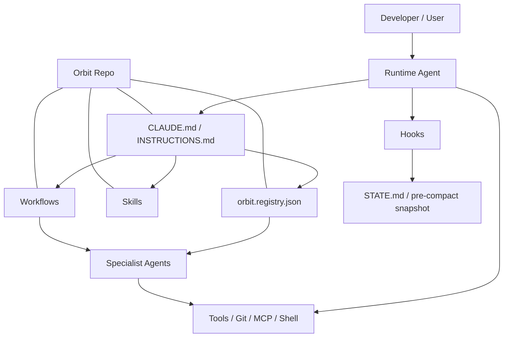
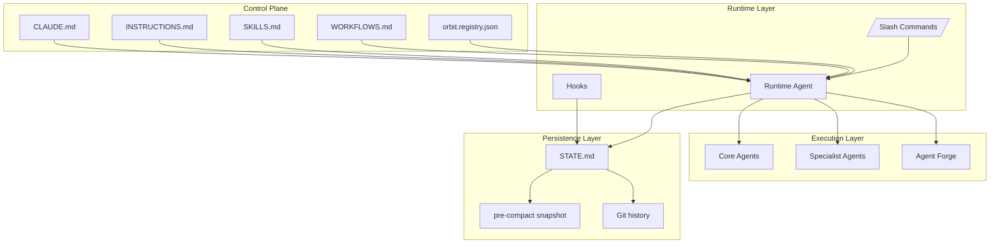

# Orbit - AI Agent Orchestration Framework

> Production-grade agentic system for designing, building, deploying, and monitoring any kind of work
> **v1.0** | Soupler Engineering Standard | Enterprise-ready

---

## What is Orbit?

Orbit is a tool-agnostic, production-grade control plane for agent-driven development. It helps any compatible coding agent behave like a coordinated engineering team with specialized roles for architecture, implementation, strategy, review, security, DevOps, data engineering, and research.

It is designed to work across runtimes, not just one assistant. Claude, Codex, and Antigravity can all use the same repository-level instructions, skills, workflows, hooks, and registry.

Key capabilities:

- Smart agent routing - classifies intent, selects the best agent, and falls back to Agent Forge
- Agent Forge - dynamically creates new specialized agents when none fits well enough
- Wave execution - parallel subagent dispatch with fresh contexts and no context rot
- Model routing - low-cost routing for classify, implement, and complex reasoning tasks
- Context preservation - pre-compact hooks plus `/orbit:resume` protect long-running work
- RIPER workflow - Research -> Innovate -> Plan -> Execute -> Review for disciplined execution
- Prompt injection defense - hook-based detection for risky or adversarial input
- 17 domain skills - TDD, architecture, security, deployment, AI systems, RIPER, git worktrees, prompt safety, and more
- Language-specific reviewers - TypeScript, Python, and Go specialists instead of a generic reviewer only
- Production state - persistent STATE.md memory, atomic commits, and project-level operational memory
- Machine-readable registries - agent, skill, and workflow metadata live in `orbit.registry.json`

### Compatibility

Orbit is intentionally runtime-agnostic:

- Claude Code - first-class support through `CLAUDE.md`, hooks, and slash commands
- Codex - works with Codex-managed sessions and repository instructions
- Antigravity - compatible with any agent runtime that can read markdown instructions and execute repo-local workflows
- Other runtimes - if the tool can follow repo instructions, run scripts, and respect hook policies, it can use this framework

### Architecture



### Flow Diagram


### Component Diagram



### Tool-Agnostic Control Plane

The framework separates orchestration policy from runtime implementation:

- The repository defines the rules, roles, workflows, and persistence format
- The active agent runtime interprets those instructions
- The same repo structure can be used by Claude, Codex, or Antigravity without rewriting the workflow model
- The framework is not tied to one model vendor or one CLI surface
- Platform-specific behavior should live in adapters, not in the core control plane

---

## Installation

```bash
# Clone Orbit into your tooling
git clone https://github.com/yourorg/orbit.git ~/.orbit

# Install into current project (Claude Code)
cd your-project
bash ~/.orbit/install.sh --local --tool claude

# Install globally (all projects)
bash ~/.orbit/install.sh --global --tool claude

# Install for all tools
bash ~/.orbit/install.sh --global --all
```

### Verify

Start a Claude Code session in your project and type `/orbit:help`. You should see the full command list.

---

## Repository Layout

The repository is organized as a control plane:

- `CLAUDE.md` is the session orchestrator for Claude-compatible runtimes
- `orbit.config.json` and `orbit.config.schema.json` define runtime config and validation
- `orbit.registry.json` is the machine-readable source of truth for agents, skills, and workflows
- `INSTRUCTIONS.md`, `SKILLS.md`, and `WORKFLOWS.md` are the human-readable control-plane docs
- `agents/` and `forge/` hold the role-based agent definitions
- `skills/` holds reusable process frameworks that get loaded on demand
- `hooks/` contains the lifecycle and safety hooks
- `commands/` defines the `/orbit:` command surface
- `state/` and `examples/` show how long-running work is persisted and resumed
- `docs/` contains supporting guidance for token optimization, MCP usage, and playbooks
- `install.sh` wires the framework into a target project

---

## Core Concepts

### 1. Orbit Orchestrator

The `CLAUDE.md` file is the brain for Claude Code sessions, but the same control-plane idea works in other runtimes too. It classifies your request, selects the right agent, designs parallel execution, and dispatches work with proper context.

### 2. Agents

Specialized agents with deep domain expertise. Each has:

- Clear triggers for when it activates
- Domain-specific operating rules
- Required skills to load
- Defined output formats
- Quality standards and anti-patterns

### 3. Skills

Reusable process frameworks. Skills are loaded into subagent contexts when needed - lazy, targeted, not everything at once. TDD is always loaded for code. Security is always loaded for architecture. Planning is always loaded for roadmaps.

### 4. Wave Execution

Work is broken into dependency-ordered waves. Tasks within a wave run in parallel, each in a fresh context. No accumulated context rot. Your main session stays light while subagents do the heavy lifting.

### 5. Agent Forge

When no existing agent covers your task well enough, `/orbit:forge` creates a new specialized agent on the spot. It defines it, registers it, and dispatches your task to it - all in one step.

---

## Slash Commands

```bash
# Project lifecycle
/orbit:new-project         # Start a project from scratch (brainstorm -> spec -> roadmap)
/orbit:plan [N]            # Research + design + task breakdown for phase N
/orbit:build [N]           # Execute phase N with parallel wave architecture
/orbit:verify [N]          # Test + UAT + review phase N
/orbit:ship [N]            # PR + deploy + release tagging
/orbit:next                # Auto-detect state and run the next logical step
/orbit:milestone           # Archive milestone, tag release, start next

# Quick work
/orbit:quick <task>        # Ad-hoc task with full Orbit quality guarantees
/orbit:riper <task>        # Structured thinking: Research->Innovate->Plan->Execute->Review

# Agent management
/orbit:forge <description> # Build a new specialized agent for this domain

# Code quality
/orbit:review              # Full code + architecture review (language-specific specialists)
/orbit:audit               # Security audit via security-engineer agent (OWASP/STRIDE)
/orbit:debug <issue>       # 4-phase systematic root cause debugging

# Infrastructure
/orbit:deploy <env>        # Deploy to staging or production
/orbit:rollback            # Revert last deployment
/orbit:monitor             # Production health check + observability report

# Context + cost
/orbit:resume              # Reload STATE.md after context compaction (or new session)
/orbit:progress            # Current project status
/orbit:cost                # Token usage + estimated cost for session
/orbit:worktree            # Manage git worktrees for parallel wave execution

# Navigation
/orbit:map-codebase        # Deep analysis of existing repo
/orbit:help                # All commands and usage
```

---

## Usage Examples

### Start a new project

```
User: I want to build an e-commerce platform for handmade goods
Orbit: [loads brainstorming skill, asks 5 targeted questions]
       [spawns researcher subagent - domain, stack options, pitfalls]
       [produces PROJECT.md, REQUIREMENTS.md, ROADMAP.md]
       [presents roadmap for approval in sections]
       Ready. Run /orbit:plan 1 to plan Phase 1.
```

### Build a feature with parallel execution

```
User: /orbit:build 2
Orbit: [reads PHASE-2-PLAN.md]
       [Wave 1: spawns 3 parallel engineer subagents]
         -> Subagent A: User model + migrations (fresh context)
         -> Subagent B: Auth endpoints (fresh context)
         -> Subagent C: Email service (fresh context)
       [Wave 1 complete. Collecting SUMMARY.md files.]
       [Wave 2: spawns 2 parallel subagents]
         -> Subagent D: Checkout flow (reads Wave 1 outputs)
         -> Subagent E: Payment integration (reads Wave 1 outputs)
       [Verification subagent: all requirements met?]
       Phase 2 complete. 47 files changed, 312 tests passing.
```

### Create a custom agent

```
User: /orbit:forge "Build and optimize Rust WebAssembly modules for a game engine"
Orbit: [loads agents/forge.md]
       [analyzes domain: Rust, WASM, game engine patterns, performance]
       [designs wasm-engineer agent with Rust/WASM-specific rules]
       [writes agents/wasm-engineer.md]
       [registers in the agent registry and instruction set]
       Agent forged. Dispatching your task now...
```

### Ad-hoc quick task

```
User: /orbit:quick Add rate limiting to all auth endpoints
Orbit: [classifies: ENGINEERING, QUICK, engineer agent]
       [loads skills/security.md for rate limit patterns]
       [writes failing test for rate limiting behavior]
       [implements with express-rate-limit per security.md pattern]
       [all tests green, committed: feat(security): add auth endpoint rate limiting]
       Done. 3 files changed, 8 tests added.
```

---

## Complex Scenario: Secure Feature Delivery

Scenario: a product team asks for a new admin billing export feature that must be audited, permissioned, and delivered without exposing customer data.

How Orbit handles it:

1. Classify the request as `SYNTHESIS`, `PROJECT`, and `AUTONOMOUS`.
2. Route to `strategist` first because the work spans product, security, backend, and delivery.
3. Pull in `security-engineer`, `engineer`, `data-engineer`, and `reviewer` in parallel once the scope is clear.
4. Use `planning.md` to split the work into waves: schema changes, API design, export job, permission checks, and audit logging.
5. Let `security.md` define data-access rules, redaction rules, and failure handling before any implementation starts.
6. Execute each wave in fresh contexts so the auth logic, export job, and UI concerns do not bleed into each other.
7. Verify with tests, threat modeling, and review before shipping the feature.
8. Persist the result to `STATE.md`, then commit atomically so the next session can resume cleanly.

Why this matters:

- Without the framework, the team would likely build the feature in a single linear thread, miss a review step, and leave security decisions undocumented.
- With the framework, the same work is decomposed into roles, waves, and checks so security, data handling, and delivery quality are all explicit.

---

## Token Optimization Strategy

Orbit is designed from the ground up to minimize token consumption:

| Strategy               | Implementation                                                               |
| ---------------------- | ---------------------------------------------------------------------------- |
| Model routing          | Haiku for classify/extract, Sonnet for implement, Opus for complex reasoning |
| Lazy skill loading     | Only load SKILL.md relevant to current task - not all skills                 |
| Subagent isolation     | Fresh context per task - no accumulated conversation history                |
| XML structured prompts | Claude processes XML task definitions with higher fidelity and fewer tokens  |
| Targeted file loading  | Only load files directly referenced in the task - never full codebase        |
| STATE.md as memory     | Cross-session memory without bloating context                                |
| Prompt caching         | System prompt + skills are stable - eligible for prompt caching              |

---

## Why Use This Framework

### With Orbit

- Requests are classified before execution, so the right agent gets the right job
- Complex work is decomposed into waves instead of being forced through one long context
- Skills create repeatable standards for TDD, architecture, security, and deployment
- Hooks and STATE.md make long-running work resumable
- The same repo can work across Claude, Codex, and Antigravity with minimal adaptation

### Without Orbit

- The assistant tends to jump straight into implementation
- Important review and planning steps can be skipped under pressure
- Context grows until older decisions become fuzzy
- Security and operational concerns often depend on memory instead of explicit process
- Multi-step work is harder to resume and harder to audit

---

## Sample Eval Set

Use [docs/eval-dataset.md](/Users/sunnysrivastava/Documents/repos/Soupler/soupler-hq/nexus/docs/eval-dataset.md) to check whether routing, workflow choice, and portability claims still hold after changes.

Representative prompts:

- Add rate limiting to auth endpoints
- Design a multi-region active-active architecture
- Review this React auth component for bugs
- Create a CI/CD rollback plan for production
- Unknown domain with high uncertainty

---

## Adding Your Own Skills

Create a new skill file in `skills/`:

```markdown
# SKILL: {Domain Name}

> One-line description of what this skill governs

## ACTIVATION

When is this skill loaded? What triggers it?

## CORE PRINCIPLES

{Domain-specific rules, not generic advice}

## PATTERNS

{Code examples, templates, decision frameworks}

## CHECKLISTS

{Verifiable criteria for quality work in this domain}

## ANTI-PATTERNS

{What NOT to do, with specific consequences}
```

Then register it in `CLAUDE.md` under "SKILLS AUTO-LOADING".

---

## Philosophy

- Systematic over ad-hoc - process beats guessing every time
- Parallel over sequential - wherever tasks are independent, run them simultaneously
- Fresh context over accumulated rot - subagents start clean, finish clean
- Evidence over claims - verify before declaring done
- Atomic commits - every task traceable, independently reversible
- YAGNI + DRY - build what's needed, reuse what exists
- TDD always - tests before implementation, without exception
- Security by design - authentication, authorization, and audit logging designed in, not bolted on

---

## License

MIT - use freely, contribute back if it helps you.

---

## Contributing

Add skills, agents, or patterns. The skill for writing skills is in `skills/`.
The key question before any contribution: does this encode genuine domain expertise, or is it generic advice?
